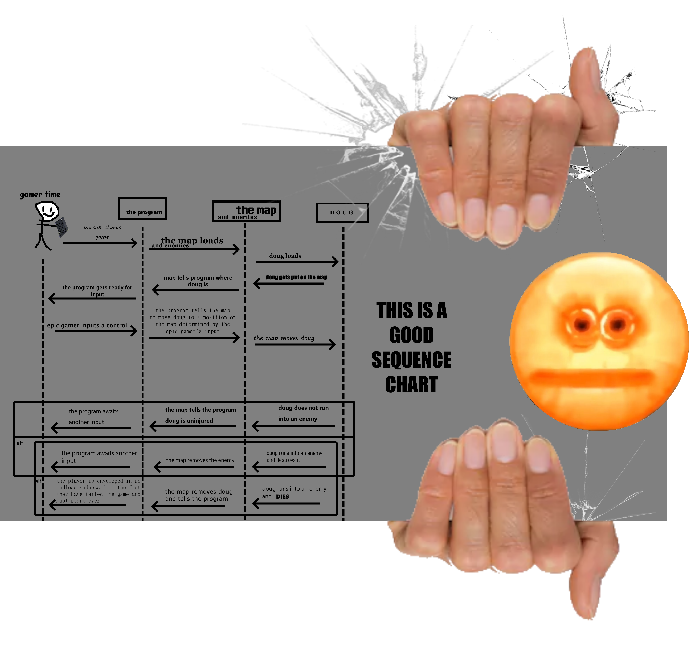

# DigDoug

DigDoug is a game where you play as a character, Doug, who uses his versatile shovel-head to excavate precious gems. All the while you're busy collecting these gems, you must also attempt to avoid enemies trying to thwart your mission.

 

## Motivation

Our motivation comes from the famous Atari game, DigDug, made by the Japanese company Namco. Our game shares the same general goal as DigDug does, but instead of eliminating enemies, your character is completely powerless and must instead escape them and shoot for the simpler goal of digging for minerals. 

## Installation

## Screenshots

## Diagrams

### UML

### Sequence

### FlowChart

