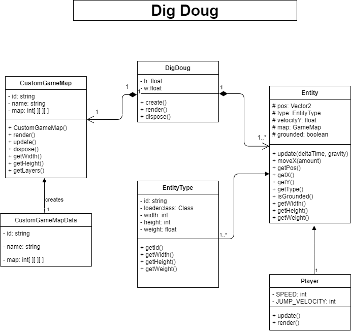
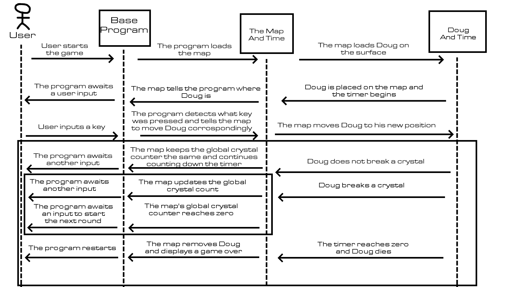
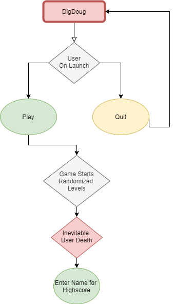
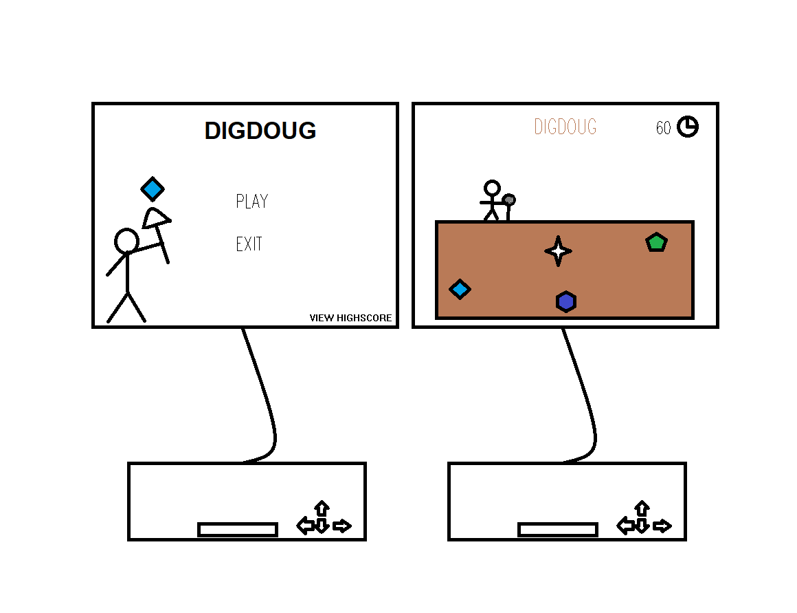

# DigDoug

DigDoug is a game where you play as a character, Doug, who uses his versatile shovel-head to excavate precious gems. All the while you're busy collecting these gems, you must also attempt to avoid enemies trying to thwart your mission.

 

## Motivation

Our motivation comes from the famous Atari game, DigDug, made by the Japanese company Namco. Our game shares the same general goal as DigDug does, but instead of eliminating enemies, your character is running against the clock.

## Installation

In the release section of the repository, download the .jar file. Launch the file using a Java Runetime Enviroment(JRE) 11 and up.  

## Screenshots

## Video

## Diagrams

### UML

### Sequence

### FlowChart

## Mockup

## Project Status

 After creation of DigDoug V1.0, there will likely be no newer updates to the project, due to the coder's busy schedule and utter lack of desire to continue this project.

## Acknowledgement

<b>Cole :</b> https://github.com/cole-giles 
  <b>Logan :</b> https://github.com/logan-gosch  
  <b>Noah :</b> https://github.com/NoahGiles 
  <b>Orion :</b> https://github.com/122L 

